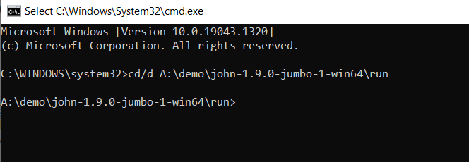
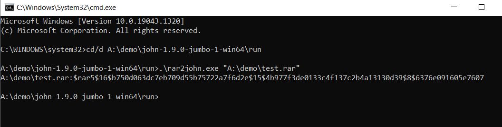
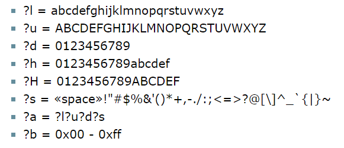
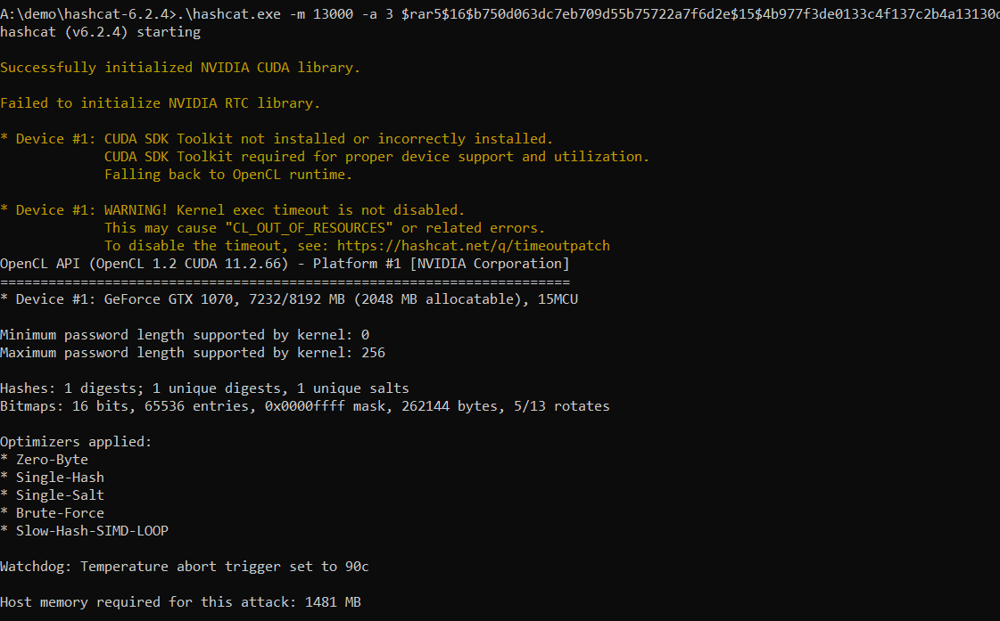
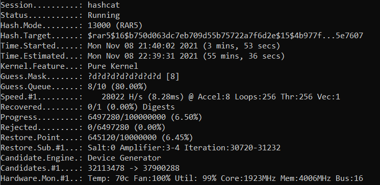
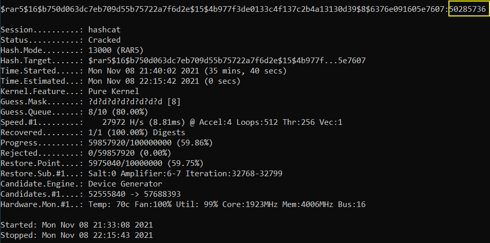

# Tutorial-password-recovery-for-WinRAR-file

## Index<br />
### [Introduction](#intro)
### [Tutorial](#tut)

<h3 id="intro"> Introduction</h3>
I had an experience on forgot the password of an encrypted WinRAR file. I resolved this problem by using Hashcat and John the Ripper jumbo (For the rar2john) together 
to recover the password. I am now sharing the way of how I use them, hopefully, it will be useful to the others that met the same problem as I do.

<br /><br />
The rar2john in John the Ripper jumbo is used to find the hash of the encrypted .rar file, such that Hashcat can be used.
<br /><br /> 
John the Ripper jumbo can be found at <https://www.openwall.com/john/> and GitHub repository: <https://github.com/openwall/john>
<br /><br /> 

The Hashcat is used to crack the hash generated to find the password. The advantage of using Hashcat is it can use Cuda, which allows a much better speed of cracking 
by using GPU that supports CUDA when compared to CPU. There are different methods available to crack the password, I chose to use the slowest, but universal solution, 
brute force, that tries every possible password (and calculates the respective hash) until a match to the target encrypted .rar hash, password recovered. If you 
believe the target password is inside a common password dictionary like "1234", "0000", then using a common password dictionary will be an option, which cracks much 
faster.
<br /><br /> 
Hashcat can be found at GitHub repository: <http://https://github.com/hashcat/hashcat>


<br /><br />
<h3 id="tut"> Tutorial</h3>
In this tutorial, we will crack the test.rar which is also provided in this respiratory. The password is 50285736 (See password_is_50285736.txt).<br />
First, open cmd.exe, then type: 

```
cd/d location_of_rar2john.exe
```

In my case, 
```
cd/d A:\demo\john-1.9.0-jumbo-1-win64\run 
```
<br />

Which go to the rar2john.exe location. Then press enter, see below:

<br /><br />

<br /><br />
To get the hash of the .rar file, type: 
```
.\rar2john.exe "rar_file_location" 
```
<br />
In my case, 

```
.\rar2john.exe "A:\demo\test.rar"
```

Press enter to get hash.
<br />

Then hash generated :
<br /><br />

```
$rar5$16$b750d063dc7eb709d55b75722a7f6d2e$15$4b977f3de0133c4f137c2b4a13130d39$8$6376e091605e7607
```

Then, cd/d to location of hashcat, in my case, 
```
cd/d A:\demo\hashcat-6.2.4<br />
```

After that, its time to brute force, type: 
```
.\hashcat.exe -m 13000 -a 3 hash -i --increment-min=1 --increment-max=10 ?d?d?d?d?d?d?d?d?d?d
```

In my case: 
```
.\hashcat.exe -m 13000 -a 3 $rar5$16$b750d063dc7eb709d55b75722a7f6d2e$15$4b977f3de0133c4f137c2b4a13130d39$8$6376e091605e7607 -i --increment-min=1 --increment-max=10 ?d?d?d?d?d?d?d?d?d?d
```

<br /><br />
This means crack from the minimum length of 1 to maximum 10, all numbers, try possible password at 0 to 9999999999, the mode is 13000 for RAR5 (12500 for RAR3-hp, 
check what type to use at beginning of the hash). To change minimum length, edit value in  "--increment-min=". To change maximum length, edit value in "--increment-max=".
<br /><br />

For ?d?d?d?d?d?d?d?d?d, which is the mask, it should match the length of the value "--increment-max=". ? means that value unknow. If a specific value of the password 
is known, like I know the first 3 password characters is 502, then, 502?d?d?d?d?d?d?, this can save time. On the letter, d means number, u means capital letter, l 
means small letter, for more, see below, which is from  <https://hashcat.net/wiki/doku.php?id=mask_attack>:
<br /><br />

After setting all conditions, press enter, 
<br /><br />
and wait...
<br /><br />

After calculation time for 35 minutes and 40 second by using GTX1070, the password 50285736 recovered (In the yellow square at below picture):
<br /><br />

As we can see how weak it is when a password is just 8 numbers in length with full of numbers, an old GTX 1070 can crack it around 1 hour for max if try from 0 to 
99999999 only. For a more secured password, a longer password and password contains a combination of numbers and small/capital characters, even symbols are recommended 
for a much better security, as the possible password combinations will be much more, thus much more time is needed to crack.
